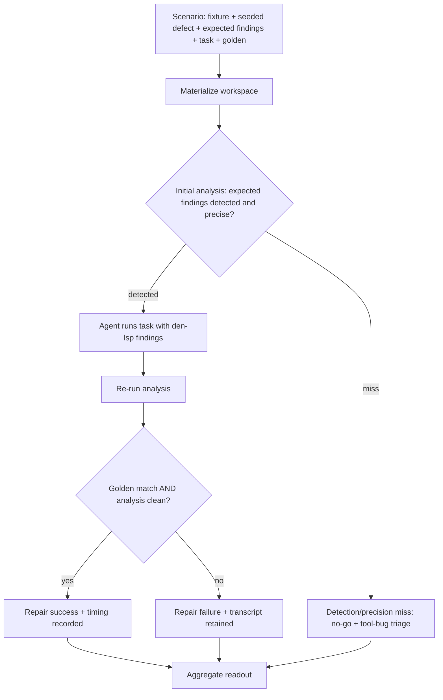
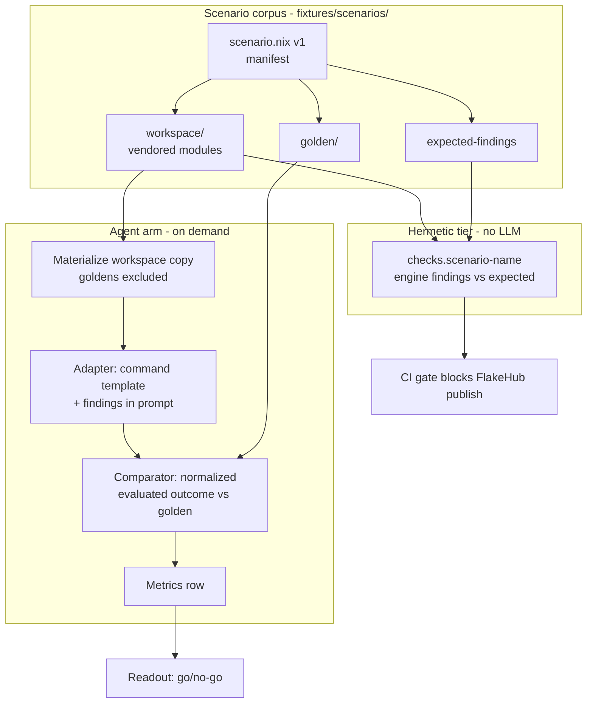

# Evidence Kernel - Plan

## Goal Capsule

- **Objective:** Prove that den-lsp's existing clear-cut fixtures produce findings a coding agent repairs correctly, via a one-time go/no-go readout built on a reusable, versioned scenario contract.
- **Product authority:** `STRATEGY.md` (metrics definitions) and the roadmap ideation record at `docs/ideation/2026-08-03-den-lsp-roadmap-ideation.html`. This plan owns only the evidence kernel; field readiness, machine-actionable repairs, and coverage expansion are separate future plans and not active scope.
- **Open blockers:** none.
- **Execution profile:** `execution: code`; local dev plus GitHub Actions CI; agent-arm runs are on-demand and incur LLM cost.
- **Stop conditions:** stop and surface if a session-settled decision proves infeasible during implementation, or if goldenability exclusions drop the clear-cut set below five scenarios with no authorable replacements (per R17).
- **Tail ownership:** the go/no-go readout and rollout judgment stay with the user; the plan ends at a rendered readout, not at field deployment.

---

## Product Contract

### Summary

Build the minimum evaluation capability that converts "we believe agents can resolve den-lsp findings" into measured numbers: a versioned scenario contract (fixture + seeded defect + agent task + golden outcome), a small runner that drives one agent through a pluggable adapter, and a go/no-go readout reporting the four strategy metrics.

### Problem Frame

Every key metric in `STRATEGY.md` — pre-completion defect catch rate, finding precision, successful repair rate, time to valid repair — is defined as "measured by the agent evaluation harness." No such harness exists. The project has high confidence that an agent receiving current findings can resolve them, but no proof, and CI currently publishes to FlakeHub without running any tests, so even engine regressions ship unvalidated.

The risk this plan guards against is equally important: a harness that tries to solve too much up front becomes a waterfall — weeks of lab honing followed by an implosion on first contact with a real repo. A sniff-test run against a real, agent-touched den repo already surfaced multiple den-lsp bugs that clean fixtures never triggered. The kernel therefore proves exactly one claim and stops; the field takes over as the primary evidence source.

### Key Decisions

- KD1. **Minimal kernel — mutation engine excluded.** (session-settled: user-directed — chosen over a full mutation-engine harness: lab-centrism delays field evidence, and the field is the better defect generator.) Governs R2, R11, R12.
- KD2. **Scenario-contract-first.** The scenario format is a deliberate, versioned contract that field-failure intake and a future mutation engine reuse; the runner stays small and disposable. (session-settled: user-directed — chosen over extending the bash fixture runner or an ad-hoc scenario layout: the corpus is the durable asset.) Governs R2, R3, R5, R14, R15.
- KD3. **Golden-outcome repair judgment.** (session-settled: user-directed — chosen over mechanical "finding gone" checks: deletion of the flagged config would masquerade as repair.) Governs R4, R7, R9.
- KD4. **One agent behind a pluggable adapter.** (session-settled: user-approved — proposed over a multi-agent matrix: a go/no-go needs one representative agent; the adapter keeps a second agent cheap to add.) Governs R6, R16.
- KD5. **Bar: 100% catch and precision; repair rate is learned, not preset.** Detection misses on the clear-cut set are tool bugs by definition; the repair number is what the kernel exists to discover. (session-settled: user-directed — chosen over preset thresholds on all four metrics: inventing repair thresholds before any data exists.) Governs R11, R17.
- KD6. **Single-arm now, control arm as dormant config.** (session-settled: user-directed — chosen over running a no-den-lsp control now: doubles agent-run cost; marginal-value proof is deferred to the field.) Governs R10.
- KD7. **Two-tier eval split.** Hermetic engine-only evals are cheap and run in CI; agent-in-the-loop evals cost LLM money and run on demand. (session-settled: user-approved.) Governs R1, R5.
- KD8. **CI test gate lands first.** (session-settled: user-approved — day-one hygiene independent of everything else.) Governs R1.

### Requirements

**CI gate**

- R1. CI runs the engine unit tests and the consumer fixture checks on every push, and FlakeHub publishing is blocked when either fails.

**Scenario contract**

- R2. A versioned scenario format bundles a base fixture reference, a seeded defect, the expected findings (the ground-truth diagnostic output for detection and precision scoring), an agent task prompt, and a golden outcome (the known-correct repair).
- R3. The scenario schema is designed against the sniff-test field failures — failure-derived fields are incorporated as failures are extracted — and those failures are encoded as the first field-sourced scenarios.
- R4. Goldenability gates membership: a fixture whose correct repair is ambiguous is excluded from the clear-cut set with a recorded reason, rather than bending the judgment or the bar.
- R5. Each scenario's detection half (defect seeded, expected findings present and precise) is runnable without an agent in the hermetic tier, so detection and precision are measurable at no LLM cost; the hermetic tier joins the CI gate once scenarios exist, leaving R1's day-one scope unchanged.
- R12. Scenarios in the initial kernel are hand-seeded — derived from existing fixtures and the sniff-test field failures — with no automated mutation engine.
- R14. Materialized scenario workspaces are self-contained or carry explicit flake input overrides — no imports reaching outside the workspace root and no workstation-specific environment dependencies — so pure evaluation succeeds anywhere, including CI.
- R15. The clear-cut seed corpus covers every engine rule: the four rules with no trigger fixture today (unregistered-class-key, class-quirk-collision, battery-replication, repetition) get scenarios authored alongside the existing three variants.

**Metrics runner**

- R6. The runner drives exactly one coding agent through a pluggable adapter; adding a second agent means supplying a new adapter definition (command template), never modifying the core runner.
- R7. Golden comparison judges the post-repair evaluated outcome semantically (normalized evaluated-output equality), not by source-text diff; the comparator's exact equivalence boundary is defined at planning time.
- R8. The runner reports catch rate, precision, repair success rate, and time to valid repair, plus evaluation wall-time as a tracked performance signal; repair time is recorded as both wall-clock and agent-turn count, with turns as the primary signal.
- R9. A repair counts as successful only when the outcome matches the golden resolution and re-analysis is clean for that scenario (finding resolved, no new gating findings introduced).
- R10. A control arm (findings withheld from the agent) exists as runner configuration but is not run by default.
- R13. The runner supports targeting a single scenario or a named subset in one invocation, in addition to running the full clear-cut set.
- R16. The adapter contract specifies how findings are presented to the agent (format and injection point), so repair outcomes are comparable across adapters.

**Readout**

- R11. The readout is a one-time go/no-go report: catch and precision must be 100% on the clear-cut set (any miss is triaged as a tool bug), while repair rate and repair time are presented as learned numbers. A passing readout authorizes entry into the field-readiness work; it is not evidence of field performance.
- R17. The readout renders only when the clear-cut set retains at least five scenarios after goldenability exclusions; below that, author more scenarios before rendering.

### Key Flows

- F1. **Scenario run.**
  - **Trigger:** Runner invoked on the clear-cut scenario set.
  - **Steps:** Materialize a workspace from the scenario's fixture and seeded defect; the agent attempts the task with den-lsp findings available; analysis re-runs on the result; the outcome is compared semantically against the golden resolution.
  - **Outcome:** One metrics row per scenario (detected, precise, repaired, wall-clock, turns); transcripts retained for failures.
  - **Covers:** R6, R7, R8, R9.
- F2. **Go/no-go readout.**
  - **Trigger:** All scenarios in the set have run.
  - **Steps:** Aggregate rows; verify catch and precision at 100%; present repair rate and time distribution.
  - **Outcome:** Any detection or precision miss marks the readout no-go and is triaged as a tool bug; otherwise the user judges entry into field readiness with the repair numbers in hand.
  - **Covers:** R11, R17.

### Acceptance Examples

- AE1. **Covers R9.** **Given** a scenario whose seeded defect is a duplicated aspect config, **when** the agent silences the finding by deleting the flagged configuration instead of extracting a shared aspect, **then** re-analysis is clean but the golden comparison fails, and the repair is recorded as unsuccessful.
- AE2. **Covers R4.** **Given** an existing fixture whose finding admits two materially different correct repairs, **when** the clear-cut set is assembled, **then** the fixture is excluded with a recorded reason and appears in no metric denominator.
- AE3. **Covers R1.** **Given** a PR that breaks an engine rule, **when** CI runs, **then** the test step fails and FlakeHub publishing does not occur.
- AE4. **Covers R5.** **Given** a rule change that introduces a false positive on a scenario's clean base fixture, **when** the hermetic tier runs in CI, **then** the precision regression is caught without any agent run.
- AE5. **Covers R11.** **Given** a readout where one seeded defect went undetected, **when** results are presented, **then** the readout is no-go regardless of the repair rate, and the miss is triaged as a tool bug.

### Scope Boundaries

**Deferred for later**

- The defect mutation engine — re-enters when hand-seeding plus field intake stop keeping the corpus ahead of rule development.
- Running the control arm — the configuration exists (R10); executing it waits for a demand for the marginal-value number.
- CI enforcement of agent metrics, trend tracking, or dashboards — the agent readout is a decision instrument, not a gate.
- The field-failure intake pipeline as a workflow — this plan encodes the existing sniff-test failures (R3); the ongoing failure-to-fixture convention belongs to the field-readiness work.

**Outside this product's identity**

- Cross-agent benchmarking or leaderboards — the kernel measures den-lsp's findings, not competing agents.

### Success Criteria

- CI blocks FlakeHub publishing when engine unit tests or consumer fixture checks fail (R1).
- The readout exists and the go/no-go decision to enter field readiness was made from it.
- Any scenario is re-runnable with a single command.
- Adding a second agent requires only a new adapter definition, with the core runner unmodified.
- The hermetic tier consumes the same scenario files as the agent runner, unchanged.
- The clear-cut set is non-empty with validated goldens, and the readout reports a measured repair-rate baseline across it.

### Dependencies / Assumptions

- The existing consumer variant triggers (`fixtures/consumer-variants/*/trigger.nix`) are the starting seed corpus; four of six rules have no trigger fixture today and require authoring (R15).
- The engine's six rules (four gating, two advisory) define the initial candidate finding set; the unit-test pattern of deriving synthetic-IR variants via functional overrides (`tests/fixtures/synthetic-ir.nix`) is reusable for the hermetic tier.
- Golden comparison requires a runner-level comparator over post-repair evaluated outputs; the vendored wrapper-stripping helper (`nix/den-analysis.nix:109-136`) is IR-capture internals, not a comparator, and does not handle syntactic variants (let-bindings, list ordering, merged attribute sets). Designing that comparator, including its semantic-equivalence boundary, is planning scope for R7.
- Agent runs incur LLM cost and are acceptable on demand at clear-cut-set scale.
- The sniff-test failure artifacts are recoverable: the original run's session transcripts survive on the workstation (locations retained in agent memory, kept out of this public repo), so the scenario schema (R3) is designed against real failure data, not recollection.

### Outstanding Questions

**Resolved during planning**

- Sniff-test failure inventory: extracted from the original session transcripts; the three scenario-worthy failures are specified in U3, and the fourth (an editor-surface `nixf` warning) is out of kernel scope.
- Scenario storage layout and adapter configuration shape: owned by KTD1, KTD3, and U2 (per-scenario directories, scenarios subflake, declarative adapter templates).
- Turn counting per adapter: owned by KTD9 and the Planning Contract assumption — turns come from the CLI's structured output when available, with a recorded wall-clock-only fallback.

**Deferred to Implementation**

- Which existing fixtures pass the goldenability gate (R4) — decided while authoring goldens in U2.
- Exact headless CLI flags for the first adapter — discovered during U7's smoke-first bring-up.

### Sources / Research

- `STRATEGY.md` — metric definitions and track framing.
- `docs/ideation/2026-08-03-den-lsp-roadmap-ideation.html` — roadmap context; this plan is its Focus 1.
- Verified against the repo: CI publishes without tests (`.github/workflows/ci.yml:7-23`); variant triggers exist (`fixtures/consumer-variants/{broken,gating-dup,advisory-only}/trigger.nix`); IR and findings document are versioned (`nix/den-analysis.nix:237,265`, `nix/engine/document.nix:24,49`); normalization machinery (`nix/den-analysis.nix:109-136`); check gate and CLI (`nix/check.nix:37-38`); rule inventory (`nix/engine/rules/structural/default.nix:5-6`, `nix/engine/rules/idiom/default.nix:4-7`); no eval/metrics tooling exists anywhere in the repo.

---

## Planning Contract

**Product Contract preservation:** Product Contract unchanged.

### Key Technical Decisions

- KTD1. **Scenario manifest is pure Nix evaluated to versioned JSON.** Each scenario declares `version = 1` and evaluates to a JSON document, mirroring the Analysis IR and findings-document versioning already in the repo. Governs R2.
- KTD2. **Scenario workspaces vendor their consumer modules.** No parent-relative imports (the existing `../../consumer/modules/*` pattern breaks pure eval outside the repo tree); CI resolves `den` from the scenarios subflake lock, and the `DEN_DIR` override in `fixtures/run-checks.bash` becomes an optional local-dev convenience instead of a hard dependency. Governs R14.
- KTD3. **Hermetic tier lives in a scenarios subflake.** `fixtures/scenarios/flake.nix` (inputs: `den` pinned, `den-lsp` declared by URL, `nixpkgs`) exposes `checks.<system>.scenario-<name>` derivations comparing engine findings against each scenario's expected findings; every invocation overrides `den-lsp` onto the local checkout with `--override-input` — the mechanics `fixtures/run-checks.bash` already proves — avoiding relative `path:` inputs and their store-copy and resolution traps. The loader includes only scenarios marked complete, so in-progress authoring never breaks the gate. This keeps `den` out of the published flake's inputs and extends the existing engine-check derivation pattern. Governs R5.
- KTD4. **Adapter is a declarative command template plus structured-output parse.** Follows eval-harness prior art (SWE-bench harness, mini-swe-agent adapters). The first adapter targets the Claude-family CLI; exact CLI flags are execution-time discovery — external research on specific flags is unverified. (session-settled: user-approved — proposed over other agent CLIs at plan scoping: the daily-driver CLI is the representative agent.) Governs R6.
- KTD5. **Findings presentation v1 is the `den-lsp-check` text report embedded in the task prompt.** The adapter records the presentation mode per run so repair rates stay comparable; a structured JSON channel is field-readiness scope. (session-settled: user-approved — confirmed at plan scoping over building the JSON CLI early.) Governs R16.
- KTD6. **Comparator is a normalized evaluated-outcome JSON comparison.** Evaluate the repaired and golden workspaces to their analysis documents, normalize (strip source positions and store paths; recursively unwrap module-provenance wrappers — the field-observed false-negative mode; sort set and array attributes; strip defaulted attributes), and require structural equality plus a clean re-analysis. The runner evaluates arbitrary materialized workspace directories through an eval expression over the `noflake`/evalModules path with the pinned `den` input — a temp workspace has no flake of its own, and evaluating the subflake would read the repo's files instead of the agent's edits. Governs R7, R9.
- KTD7. **Goldens and expected findings live outside the agent-visible workspace copy.** The runner materializes only `workspace/` for the agent; `golden/` and `expected-findings` never enter the agent's working directory (leakage guard from benchmark prior art). Governs R2, R9.
- KTD8. **Known-miss scenarios are first-class but outside the clear-cut set.** A field-sourced scenario may declare an expected miss (a defect the engine cannot yet detect); it documents honest coverage in the readout's appendix and is excluded from the 100% catch/precision denominators with a recorded reason, consistent with R4's exclusion mechanics. Known-miss status is declared at authoring time only: a clear-cut scenario for an implemented rule is never reclassified known-miss after a detection failure — that failure is a tool bug and a no-go. Governs R3, R11.
- KTD9. **Three caps on every agent run.** Harness-level wall-clock timeout per scenario, agent-level turn cap, and transcript retention for every run; budget caps ride the adapter when the CLI supports them. Governs R8.
- KTD10. **Scenario expectations are typed: finding-producing or eval-error.** An eval-error scenario (the `broken` family) declares its expected failure text instead of expected findings; the hermetic tier asserts the evaluation fails with that text rather than calling the engine, the runner feeds the captured evaluation error to the agent as the finding payload, and the comparator requires post-repair evaluation to succeed and match golden. Without the split, one eval-error workspace aborts the whole `nix flake check` before any derivation builds. Governs R2, R5, R9.

### High-Level Technical Design

The corpus is the durable asset; both consumers read the same scenario files unchanged (per the Success Criteria). The hermetic tier joins the CI gate once scenarios exist; the agent arm never runs in CI.

### Assumptions

- Exact headless flags for the chosen agent CLI (prompt passing, JSON output, turn counts) are discovered at implementation; if turn counts are unavailable from structured output, wall-clock is recorded and the turns gap is noted in the readout.
- The scenarios subflake pins a stock `den >= 0.18.0`, matching the vendored-analysis compatibility contract.
- The field-failure inventory extracted from the original sniff-test transcripts is authoritative for U3; its details are reproduced in that unit so the plan is self-contained.

### Risks & Dependencies

- **Agent nondeterminism** makes the repair-rate baseline a point estimate, not a constant. Mitigation: transcripts retained for every run (KTD9); repeated trials per scenario are a cheap readout-time option if variance looks high.
- **Golden authoring cost** may pressure toward looser text-diff checks, which would re-open the deletion-masquerade hole. Mitigation: KTD6's semantic comparison is the contract; a scenario that resists golden authoring is excluded with a reason (R4) rather than weakened.
- **Scenarios subflake lock drift**: the pinned `den` input ages independently of consumers. Mitigation: bump deliberately when compatibility work happens; the pin is a feature (reproducible detection results), not neglect.
- **LLM cost** is bounded by design: agent runs are on-demand, capped per KTD9, and the hermetic tier carries all CI-time verification.

### Sequencing

Phase A: U1 (independent, lands first per KD8). Phase B: U2 → U3, U4, U5 (corpus and hermetic tier). Phase C: U6 → U7 → U8 (comparator, runner, readout). U3 and U4 can proceed in parallel once U2 lands.

---

## Implementation Units

### U1. CI test gate before FlakeHub publish

- **Goal:** CI runs all checks on pushes and PRs and blocks FlakeHub publishing on failure.
- **Requirements:** R1; AE3. Instantiates KD8 (Governs R1).
- **Dependencies:** none.
- **Files:** `.github/workflows/ci.yml`, `fixtures/run-checks.bash`.
- **Approach:**
  1. Add a `check` job (checkout, `DeterminateSystems/determinate-nix-action`, `nix flake check`, then `fixtures/run-checks.bash`).
  2. Add `pull_request` trigger for the `check` job; keep publish on `push: main` only.
  3. Give `flakehub-publish` `needs: [check]`.
  4. Change the `DEN_DIR` handling in `run-checks.bash`: append `--override-input den "${DEN_DIR}"` only when `DEN_DIR` is set and non-empty; without it the fixture flakes resolve `den` from their locks (KTD2).
- **Patterns to follow:** existing workflow steps at `.github/workflows/ci.yml:13-23`; bash conventions of `fixtures/run-checks.bash` (strict mode, `==>`/`PASS:`/`FAIL:` logging).
- **Test scenarios:**
  - Covers AE3. A PR carrying a deliberately broken engine rule fails the `check` job and no publish occurs.
  - A green PR runs `check` without attempting FlakeHub publication.
  - `run-checks.bash` succeeds on a machine without `DEN_DIR` set.
- **Verification:** one red PR and one green PR demonstrate the gate; publish step visibly `needs: check`.

### U2. Scenario contract v1 and corpus bootstrap

- **Goal:** Versioned scenario format exists, with the three existing variants encoded as self-contained scenarios.
- **Requirements:** R2, R4, R12, R14; AE2. Instantiates KD1/KD2 (Govern R2, R11, R12; R2, R3, R5, R14, R15) via KTD1, KTD2, KTD7.
- **Dependencies:** none (parallel with U1).
- **Files:** `fixtures/scenarios/<name>/scenario.nix`, `fixtures/scenarios/<name>/workspace/`, `fixtures/scenarios/<name>/golden/`; the scenario loader stays internal to `fixtures/scenarios/flake.nix` and `tools/evidence-runner/` — no `lib.scenarios` export from the published flake (KD1 minimality).
- **Approach:**
  1. Define the manifest shape (KTD1): scenario name, seeded-defect description, expected findings, task prompt, goldenability marker with reason when excluded (R4).
  2. Lay out per-scenario directories: `workspace/` is the only agent-visible subtree (KTD7); vendored modules only (KTD2).
  3. Encode `gating-dup`, `advisory-only`, and `broken` as scenarios with expected findings; author goldens where the repair is unambiguous, recording exclusions otherwise.
- **Patterns to follow:** version field conventions in `nix/den-analysis.nix:237` and `nix/engine/document.nix:24`; trigger-module seeding style in `fixtures/consumer-variants/*/trigger.nix`.
- **Test scenarios:**
  - Loader rejects a manifest with a missing or wrong `version`.
  - Covers AE2: a scenario marked non-goldenable carries a recorded reason and is excluded from clear-cut listings.
  - A materialized workspace copy evaluates purely outside the repo tree (no parent-relative import errors).
- **Verification:** evaluating the scenarios subflake lists the three scenarios with valid manifests; a temp-dir copy of each workspace evaluates cleanly.

### U3. Field-sourced scenarios from the sniff test

- **Goal:** The three field failures become scenarios, giving the corpus real-world shapes hand-seeding would not produce.
- **Requirements:** R3, R12. Instantiates KTD8.
- **Dependencies:** U2.
- **Files:** `fixtures/scenarios/field-wrapper-masking/`, `fixtures/scenarios/field-quirk-buckets/`, `fixtures/scenarios/field-fleet-scale/`.
- **Approach:**
  1. `field-wrapper-masking`: identical aspect content wrapped in per-aspect module-provenance layers (`_file` via `den.aspects.<name>.<class>`); expected: duplication finding still fires (regression for the normalization fix).
  2. `field-quirk-buckets`: emissions in quirk/pipe bucket classes (the shapes observed flowing through capture unanalyzed) with a seeded defect; expected: declared known-miss (KTD8) — documents current coverage honestly, feeds roadmap coverage expansion.
  3. `field-fleet-scale`: generated workspace with hundreds of emissions across dozens of aspects; expected: analysis completes without eval-depth failure (regression for the hash-grouping fix in `nix/engine/rules/idiom/duplication.nix:5-8`) within the wall-time budget. Lives in an on-demand heavy-checks attribute, not the default PR gate, so CI latency stays flat.
- **Patterns to follow:** scenario layout from U2; aspect generation may use Nix `genList` for the scale case.
- **Test scenarios:**
  - Wrapper-masking scenario: hermetic tier reports the duplication finding present and precise.
  - Quirk-bucket scenario: hermetic tier passes with the declared known-miss; readout appendix lists it.
  - Fleet-scale scenario: analysis evaluates to a document (no stack overflow) and records eval wall-time.
- **Verification:** all three pass the hermetic tier with their declared expectations.

### U4. Missing-rule scenarios

- **Goal:** Every engine rule has at least one scenario, making the 100% catch/precision bar measurable across all six rules.
- **Requirements:** R15, R12.
- **Dependencies:** U2 (parallel with U3).
- **Files:** `fixtures/scenarios/rule-unregistered-class-key/`, `fixtures/scenarios/rule-class-quirk-collision/`, `fixtures/scenarios/rule-battery-replication/`, `fixtures/scenarios/rule-repetition/`.
- **Approach:** one scenario per uncovered rule, each with seeded defect, expected finding, task prompt, and golden; mirror the defect shapes the engine unit tests exercise over synthetic IR (`tests/structural/`, `tests/idiom/`) as real workspace configurations.
- **Patterns to follow:** scenario layout from U2; defect construction cues from existing unit-test IR overrides.
- **Test scenarios:**
  - Each scenario's expected finding fires with the right rule ID and severity in the hermetic tier.
  - Each golden workspace re-analyzes clean (no gating findings).
- **Verification:** hermetic tier green across all rule scenarios; corpus now spans all six rules.

### U5. Hermetic detection tier in CI

- **Goal:** Detection and precision are verified in CI at no LLM cost, joining the U1 gate.
- **Requirements:** R5; AE4. Instantiates KD7 (Governs R1, R5) via KTD3.
- **Dependencies:** U1, U2 (U3/U4 scenarios join as they land).
- **Files:** `fixtures/scenarios/flake.nix` (subflake per KTD3: `den` pinned, `den-lsp` by URL + invocation override), `fixtures/scenarios/flake.lock`, `.github/workflows/ci.yml` (add `nix flake check` on the subflake, with `--override-input den-lsp "$PWD"`, to the `check` job).
- **Approach:**
  1. Subflake evaluates each scenario workspace through the `noflake`/evalModules consumer path and runs `engine.analyze` over the captured IR.
  2. Per-scenario check derivation compares produced findings against expected findings (rule ID, severity, count; known-miss honored per KTD8); eval-error scenarios instead assert evaluation fails with the declared text (KTD10).
  2b. The loader excludes scenarios not marked complete (KTD3), so U3/U4 authoring in flight never reddens the gate; the fleet-scale scenario builds only in the heavy-checks attribute.
  3. A precision check asserts zero findings on each scenario's clean base.
- **Patterns to follow:** check-derivation mapping in `nix/dev.nix:9-25` (`engine-*` checks via `runCommandLocal`); gate semantics in `nix/check-core.nix:49-68`.
- **Test scenarios:**
  - Covers AE4: a rule change introducing a false positive on a clean base turns the tier red in CI without any agent run.
  - A seeded defect whose expected finding stops firing turns the tier red (catch regression).
  - Known-miss scenario passes without weakening either assertion above.
- **Verification:** `nix flake check path:fixtures/scenarios` green locally and wired into the CI `check` job.

### U6. Golden comparator

- **Goal:** A repair is judged by semantic outcome, not by silenced findings.
- **Requirements:** R7, R9; AE1. Instantiates KD3 (Governs R4, R7, R9) via KTD6.
- **Dependencies:** U2.
- **Files:** `tools/evidence-runner/compare.bash` (pure-Nix helpers, if any, stay under `tools/evidence-runner/`), `tests/scenarios/comparator.nix`.
- **Approach:**
  1. Evaluate repaired and golden workspaces to their analysis documents (JSON) via the KTD6 workspace-eval expression; for eval-error scenarios, pre-repair state is the expected failure and post-repair evaluation must succeed (KTD10).
  2. Normalize per KTD6: strip source positions and store paths; recursively unwrap module-provenance wrappers (the field-observed masking mode); sort set/array attributes; strip defaulted attributes.
  3. Pass = structural equality of normalized outcomes AND clean re-analysis (no gating findings, seeded finding resolved).
- **Patterns to follow:** wrapper-stripping semantics in `nix/den-analysis.nix:109-136` as the *reference* for what normalization must achieve — the comparator is its own runner-level implementation, not a reuse of that helper.
- **Test scenarios:**
  - Covers AE1: deletion of the flagged config yields clean re-analysis but golden mismatch — repair recorded failed.
  - A semantically identical repair with different attribute ordering passes.
  - A repair equivalent up to provenance wrappers passes (regression for the masking mode).
  - A repair introducing a new gating finding fails even when the golden portion matches.
- **Verification:** comparator test suite green; AE1 case demonstrably fails the repair.

### U7. Agent runner and adapter

- **Goal:** One command runs an agent against a scenario and emits a metrics row.
- **Requirements:** R6, R8, R10, R13, R16. Instantiates KD4/KD6 via KTD4, KTD5, KTD7, KTD9.
- **Dependencies:** U2, U6.
- **Files:** `tools/evidence-runner/run.bash`, `tools/evidence-runner/adapters/<name>.bash` (command template + output parse), `nix/dev.nix` (expose `apps.<system>.evidence-runner`), `tools/evidence-runner/adapters/stub.bash` (deterministic test adapter).
- **Approach:**
  1. Materialize a temp workspace copy (goldens and expected findings excluded, KTD7) and initialize a throwaway git repository with an initial commit — agents rely on `git status`/`git diff` for self-review, and the post-run diff aids inspection.
  2. Produce the findings report (`den-lsp-check` text; for eval-error scenarios, the captured evaluation error per KTD10) and embed it with the scenario task prompt (KTD5); `--no-findings` withholds it (R10 control arm).
  3. Invoke the adapter under a harness wall-clock timeout and agent turn cap (KTD9); retain transcript. Adapter failures — non-zero exit, timeout, unparseable output — record repaired=false with turns null, keep stderr in the transcript, and the sweep continues with the next scenario.
  4. Re-run analysis; call the U6 comparator; emit one JSON-lines metrics row (detected, precise, repaired, wall-clock, turns-or-null).
  5. `--scenario <name>` / `--set <subset>` targeting (R13).
- **Execution note:** smoke-first — prove the loop end-to-end with the stub adapter before touching a real agent CLI; real-CLI flag discovery happens here, not in the plan.
- **Patterns to follow:** `writeShellApplication` app wrapping in `nix/check-core.nix:36-46` with `runtimeInputs` declaring `jq`, `nix`, `git`, and coreutils, and host `PATH` preserved so host-installed agent CLIs stay reachable; strict-mode bash with exit-code trapping from `fixtures/run-checks.bash`.
- **Test scenarios:**
  - Stub adapter applies the golden → row records repaired=true with timing fields populated.
  - Stub adapter deletes the flagged config → row records repaired=false (comparator path).
  - Stub adapter sleeps past the timeout → run recorded as failed-timeout, runner recovers and continues the set.
  - `--no-findings` produces a row flagged as control-arm; `--scenario` runs exactly one scenario.
- **Verification:** full stub-adapter sweep over the corpus produces a complete metrics file deterministically; one real-agent run on a single scenario succeeds end to end.

### U8. Go/no-go readout

- **Goal:** Aggregate metrics render as the decision instrument the kernel exists to produce.
- **Requirements:** R11, R17; AE5. Instantiates KD5 (Governs R11, R17).
- **Dependencies:** U7.
- **Files:** `tools/evidence-runner/report.bash`.
- **Approach:**
  1. Aggregate metrics rows: catch rate, precision, repair rate, wall-clock and turn distributions, per-scenario table.
  2. Enforce gates: any detection/precision miss on a clear-cut scenario marks the readout no-go with tool-bug triage notes (AE5); refuse to render below five clear-cut scenarios (R17).
  3. Known-miss scenarios render in a coverage appendix, outside the denominators (KTD8).
  4. Frame the verdict as authorization to enter field readiness (R11), not field-performance proof.
- **Patterns to follow:** report text rendering conventions in `nix/engine/render.nix` / `nix/check-core.nix:31-46`.
- **Test scenarios:**
  - Covers AE5: a fixture metrics file with one undetected seeded defect renders no-go regardless of repair rate.
  - A metrics file with four clear-cut scenarios refuses to render and says why.
  - A clean file renders catch/precision 100%, measured repair baseline, and the field-readiness framing.
- **Verification:** readout generated from the real corpus run; gates demonstrated with fixture metrics files.

---

## Verification Contract

| Gate | Command | Proves |
|---|---|---|
| Engine + unit checks | `nix flake check` | Engine rules and loader tests green (U1, U2) |
| Consumer E2E | `fixtures/run-checks.bash` | Variant fixtures behave (works without `DEN_DIR`) |
| Hermetic scenario tier | `nix flake check path:fixtures/scenarios` | Detection + precision across the corpus, no LLM (U5) |
| Runner smoke | `nix run .#evidence-runner -- run --adapter stub --set clear-cut` | Deterministic end-to-end loop incl. comparator (U6, U7) |
| Readout gates | `nix run .#evidence-runner -- report` | 100% catch/precision enforcement, N>=5 floor, no-go path (U8) |

CI runs the first three on every push and PR and blocks FlakeHub publishing on failure. The runner and readout gates are on-demand (agent runs cost money); the stub-adapter smoke is free and belongs in local pre-merge habit for runner changes.

---

## Definition of Done

- CI blocks FlakeHub publish on any failing check, demonstrated on a real red PR (AE3).
- Scenario corpus spans all six engine rules plus the three field-sourced scenarios; at least five scenarios are goldenable clear-cut members (R17), exclusions recorded with reasons (R4).
- Hermetic tier green in CI over the full corpus (AE4 exercised).
- Stub-adapter sweep produces a complete, deterministic metrics file; comparator rejects the deletion case (AE1).
- One full clear-cut sweep against the chosen agent CLI completed; readout rendered with 100% catch/precision, a measured repair-rate baseline, and time distributions (AE5 path demonstrated with fixture data).
- The go/no-go decision to enter field readiness is recorded from the readout.
- No abandoned experimental code: dead ends from adapter/comparator exploration removed before done.
