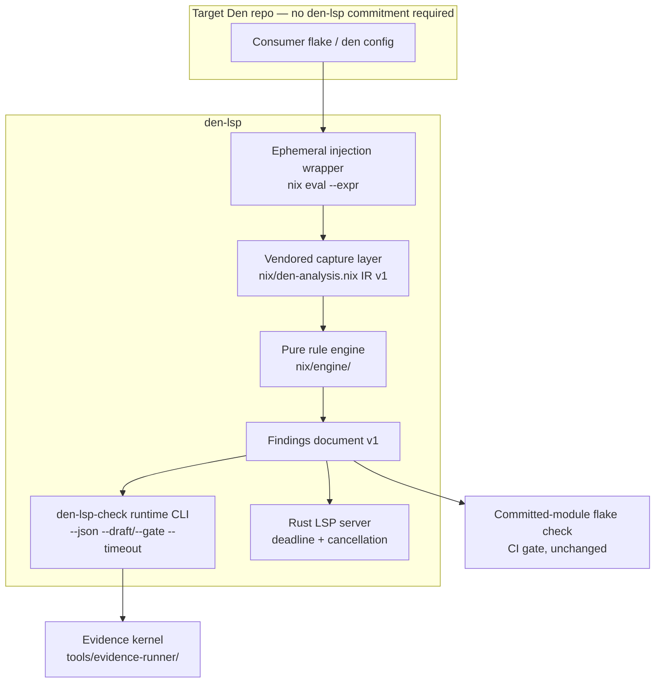
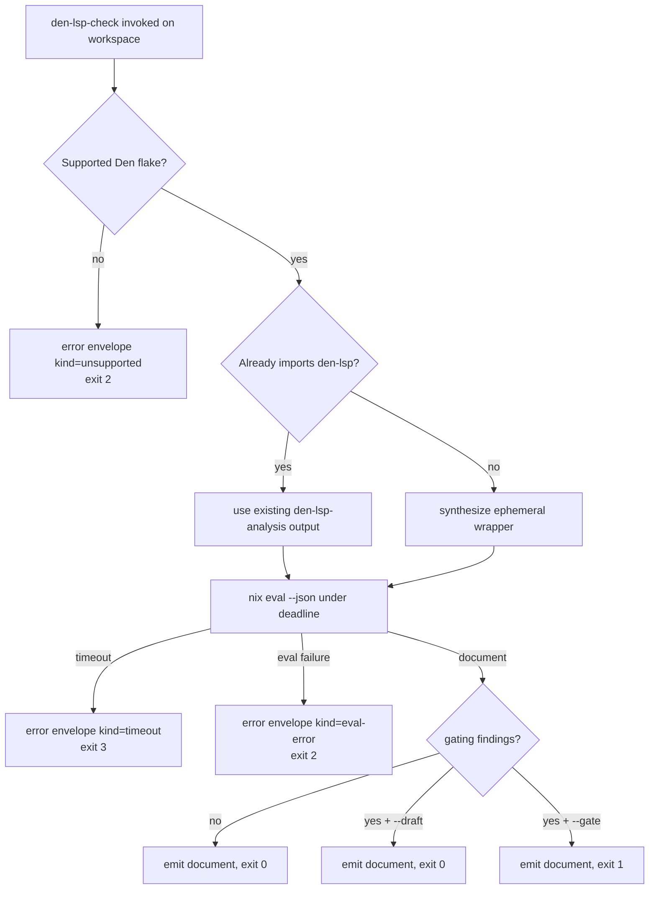

# feat: Field readiness — zero-touch injection, agent CLI contract, reliability floor

## Goal Capsule

- **Objective:** Make den-lsp usable against real Den repos by real coding agents with zero adoption friction: analyze any supported stock Den consumer flake (den ≥ 0.18.0) without a committed den-lsp input, deliver findings over a stable machine contract with unambiguous exit semantics, and bound every evaluation so nothing hangs silently.
- **Authority hierarchy:** This plan > roadmap ideation record (`docs/ideation/2026-08-03-den-lsp-roadmap-ideation.html`, Focus 2) > `STRATEGY.md` tracks. Repo conventions (`fixtures/scenarios/README.md` authoring rules, `CONCEPTS.md` vocabulary) govern fixture and scenario work.
- **Stop conditions:** Stop and surface if the ephemeral wrapper cannot reproduce the committed-module analysis result on the existing consumer fixtures (R2 would be unfalsifiable), or if pure-Nix safety limits (uncatchable missing-attribute errors) block invocation-time module reconstruction.
- **Execution profile:** Five dependency-ordered units; U1 and U3 are independent starts. Local verification per unit; full gates in the Verification Contract.
- **Tail ownership:** Executor owns README/docs updates named in U5 and CI wiring named in unit test scenarios; no release or publish steps beyond existing CI.

---

## Product Contract

### Summary

den-lsp's evidence kernel returned a GO verdict (100% catch, 100% precision, 8/8 repairs), clearing the roadmap's bootstrap gate. This plan executes Focus 2, "Field readiness": (1) zero-touch ephemeral analysis injection so den-lsp analyzes any stock Den consumer flake at invocation time; (2) an agent-consumable CLI contract — `den-lsp-check` with `--json`, `--draft`/`--gate` strictness, and a documented exit taxonomy; (3) a reliability floor — deadlines on every `nix eval`, cancellation of superseded LSP evaluations, timeouts surfaced instead of silent hangs — plus a field-failure→fixture intake convention that turns real-world breakage into eval corpus growth.

### Problem Frame

Field exposure produces the defect distribution that matters: a sniff-test against one real agent-touched Den repo surfaced multiple bugs clean lab fixtures never triggered. But today the field cannot reach den-lsp cheaply. Adoption requires a two-step flake commitment (declare the `den-lsp` input, import `flakeModules.default` — `fixtures/consumer/flake.nix` is the template). The only CLI (`nix/check-core.nix` `gateFor`) cats a build-time text report agents must scrape, with one overloaded exit signal (nonzero iff gating). The LSP server spawns `nix eval` with no deadline and no cancellation (`server/src/eval.rs`), so a slow or wedged evaluation hangs silently and a stale result can publish after a newer save. Every one of these is friction between the tool and its primary persona — coding agents validating completion.

### Requirements

**Zero-touch injection**

- R1. den-lsp analyzes any stock Den consumer flake (den ≥ 0.18.0) with no den-lsp flake input, no committed module import, and no repository configuration. The injection wrapper is synthesized at invocation time.
- R2. An already-instrumented repo (one that imports `den-lsp.flakeModules.default`) is analyzed without double injection, and its result is identical to the committed-module path.
- R3. A target that is not a supported Den flake produces an explicit unsupported-target outcome, distinct from a Den evaluation error.

**Agent CLI contract**

- R4. `den-lsp-check --json` emits the findings document (contract v1, `nix/engine/document.nix`) on stdout: `version`, deterministic finding order, and every v1 finding field — `rule`, `severity`, `aspectPath`, `position` (file/line/column or null), `message`, `fix`, `docRef` — plus `summary`. stdout carries only JSON; human diagnostics go to stderr.
- R5. Exit status encodes exactly one of the documented outcome classes: clean/advisory pass, gating block, evaluation failure, timeout, usage error. No class shares a code with another.
- R6. `--draft` reports gating findings but exits as a pass; `--gate` (the default) makes gating findings block. Both are per-invocation flags; no repo-level configuration exists.

**Reliability floor**

- R7. Every analysis evaluation is bounded by a deadline, in the CLI and in the LSP server. A timeout is surfaced — as a distinct CLI outcome class with a machine-readable error payload, and as an LSP diagnostic — never a silent hang.
- R8. When a newer LSP trigger supersedes an in-flight evaluation, the in-flight `nix eval` child process is killed and its result never publishes. Only the newest result reaches diagnostics.

**Evidence and intake**

- R9. The evidence kernel exercises the real CLI contract: hermetic coverage asserts the JSON payload shape and the full exit matrix, and agent adapters receive complete finding context (including `fix`, `docRef`, and column) rather than the current reduced text.
- R10. A field-failure intake convention is documented: every real-world breakage (crash, wrong finding, hang) becomes a scenario or fixture in the eval corpus, authored under the existing goldenability rules.
- R11. README documents the zero-touch try-before-adopt invocation and the agent contract (JSON schema pointer, flags, exit codes).

### Acceptance Examples

- AE1. **Given** a stock Den consumer flake with no den-lsp input and a seeded gating defect, **when** `den-lsp-check --json` runs against it, **then** stdout is a valid v1 findings document containing the gating finding with non-empty `fix` and `docRef`, and the exit status is the gating-block class.
- AE2. **Given** the same workspace, **when** the agent runs with `--draft`, **then** the same findings document is emitted and the exit status is the pass class.
- AE3. **Given** an evaluation forced to exceed the deadline, **when** the CLI runs, **then** stdout is a machine-readable error payload (no findings), the exit status is the timeout class, and the process terminates within the deadline plus a small grace period.
- AE4. **Given** the instrumented base consumer fixture and an un-instrumented copy of the same configuration, **when** both are analyzed, **then** the normalized findings documents are identical.
- AE5. **Given** two LSP save events in quick succession where the first evaluation is still running, **when** the second trigger fires, **then** the first child process is killed and only the second evaluation's diagnostics publish.

### Scope Boundaries

**In scope:** the three Focus 2 features (2a, 2b, 2c) plus evidence-kernel coupling and onboarding docs.

**Deferred to Follow-Up Work**

- Machine-actionable structured fixes and LSP CodeActions (roadmap Focus 3) — the JSON contract here is the delivery channel Focus 3 will fill.
- MCP wrapper over the CLI — stays cheap to add if an agent runtime demands it; the CLI is the semantic source of truth.
- New evaluated-graph rules (roadmap Focus 4).
- Delegating the module-generated per-consumer `den-lsp-check` app to the new runtime CLI — keep the existing app's behavior unchanged in this plan; unify later if divergence bites.

**Outside this product's identity**

- Telemetry/observability infrastructure (Langfuse/PostHog rejected 2026-08-07: the readout is a decision instrument, not a monitored system; the useful signal already lives in transcripts).
- Finding suppressions (`# den-lsp:ignore`) — deferred until field evidence shows where legitimate exceptions occur (ideation deferred item D4).

### Sources

- `docs/ideation/2026-08-03-den-lsp-roadmap-ideation.html` — Focus 2 definition, MCP rejection rationale, deferred items D1–D4.
- `STRATEGY.md` — tracks served: Agent feedback loop (primary), Evaluation and evidence (kernel coupling), Den analysis contract (wrapper preserves the vendored-capture stance).
- `docs/solutions/test-failures/golden-mismatch-unpinned-free-variables.md` — goldenability constraints governing all new scenarios (pin every agent-chosen free variable; strict normalized comparison stays).

---

## Planning Contract

### Key Technical Decisions

- KTD1. **The agent channel is a runtime CLI shipped from den-lsp's own flake, not the module-generated gate app.** (session-settled: user-approved — chosen over a resident MCP server: den-lsp latency is `nix eval`-bound and amortized by the eval cache, not a daemon; a JSON CLI is cheaper for agents than per-session tool schemas.) The existing `gateFor` app is built from a precomputed report inside a consumer's evaluation, so it can never serve an arbitrary un-instrumented repo; the new `den-lsp-check` is an app on den-lsp's flake that evaluates the target workspace at invocation time. The module-generated app and the flake check keep their current behavior as the CI-gate surface.
- KTD2. **Ephemeral injection reuses the hermetic tier's reconstruction pattern.** `fixtures/scenarios/flake.nix` already re-evaluates a consumer's Den configuration under flake-parts with `den.flakeModules.default` + den-lsp's injection module. The invocation-time wrapper generalizes this: `nix eval --expr` over `builtins.getFlake` on the target, preferring an existing `den-lsp-analysis` output when the repo is already instrumented (R2), otherwise reconstructing evaluation with `nix/inject-analysis.nix` added. Both consumer shapes are covered: flake-parts (`nix/check.nix`) and plain evalModules (`nix/check-noflake.nix`). Institutional constraint honored: emission stays lazy behind the `declared` flag; capture failures propagate as evaluation failures, never swallowed by `tryEval`.
- KTD3. **Exit taxonomy:** 0 = pass (clean, advisory-only, or gating under `--draft`); 1 = gating block under `--gate`; 2 = evaluation failure (Den eval error or unsupported target, disambiguated by an `error.kind` field in the JSON payload); 3 = timeout; 64 = usage error. `--gate` is the default — it preserves the existing app's semantics and is the safe default for a completion checkpoint; agents opt into `--draft` mid-edit.
- KTD4. **Timeout and eval failure are outcome classes, not findings.** The engine never ran, so no findings document exists to embed a synthetic finding in. The CLI emits a versioned error envelope on stdout (`{version, error: {kind, message}}`) with the matching exit class; the LSP surfaces timeout the same way it surfaces eval failure today — an ERROR diagnostic (the existing `eval-error` path in `server/src/diagnostics.rs`). Agents treat these as "analysis unavailable," never as semantic defects.
- KTD5. **JSON contract v1 is the existing findings document, pinned — no second schema.** `nix/engine/document.nix` already versions the document and sorts deterministically (severity, then rule, then aspect path). The CLI passes it through; the contract work is pinning field names, severity vocabulary, ordering, position nullability, and the stdout/stderr split in docs and fixtures. Evolution goes through the existing `version` field.
- KTD6. **Reliability primitives: `tokio::time::timeout` + child-process ownership + generation guard.** Every `nix eval` the server spawns — the pre-analysis system-detection eval as well as the analysis eval — runs under a deadline. The evaluator boundary must own its child process: spawn with kill-on-drop and expose kill/abort to the orchestrator, so a deadline, drop, or supersession kills the `nix` child rather than merely abandoning its future. Tag each evaluation with a generation counter so a superseded result is discarded before publish (R8). The seam is the existing `NixEvaluator` trait boundary and the orchestrator's spawned loop in `server/src/eval.rs`; extending that boundary to surface process ownership is in scope for U3. CLI deadline is a `--timeout <seconds>` flag (default 120); the LSP deadline is a constant (60s) tuned later if field evidence demands a knob.
- KTD7. **The evidence kernel is the contract harness.** `tools/evidence-runner/eval-workspace.bash` currently bypasses the CLI and evaluates `path:$WORKSPACE#den-lsp-analysis` directly. Kernel coupling means: eval-workspace gains an ephemeral-injection mode for un-instrumented targets, hermetic coverage asserts the CLI's payload and exit matrix, and the adapter presentation gains `fix`/`docRef`/column so agents get context parity with the document (today's `FINDINGS_TEXT` omits them).

### High-Level Technical Design

Component topology after this plan — one analysis/document contract, three consumers, one new invocation-time adapter:

Invocation outcome flow (CLI); the same classes map to LSP diagnostics:

Diagrams are rendered from the decisions above; prose is authoritative where they disagree.

### Open Questions

All deferred (non-blocking); none holds readiness back.

- Deferred: exact `nix eval --expr` reconstruction details for flake-parts consumers (module ordering, lock handling for dirty trees) — resolve during U1 implementation against the fixtures; `eval-workspace.bash`'s `--reference-lock-file` pattern is the starting point.
- Deferred: whether the module-generated per-consumer app eventually delegates to the runtime CLI — revisit after field usage shows whether the two surfaces drift.
- Deferred: LSP deadline value tuning (60s initial) — revisit with field evidence; the CLI's `--timeout` flag is the calibration knob agents control today.

---

## Implementation Units

### U1. Ephemeral injection wrapper

- **Goal:** den-lsp analyzes any stock Den consumer flake at invocation time, with instrumented-repo reuse and an explicit unsupported-target outcome.
- **Requirements:** R1, R2, R3
- **Dependencies:** none
- **Files:** new wrapper expression under `nix/` (e.g. an `ephemeral.nix` consumed via `nix eval --expr`); `nix/check-core.nix` (reuse `analysisFor`); `fixtures/consumer-variants/` (new un-instrumented variant mirroring `fixtures/consumer/`); `tests/default.nix` wiring; test assertions under `tests/`.
- **Approach:**
  1. Detection order: target exposes `den-lsp-analysis` → use it (R2); target is a Den flake without den-lsp → reconstruct evaluation with `nix/inject-analysis.nix` added, mirroring the hermetic tier's pattern in `fixtures/scenarios/flake.nix`; target has no Den config → explicit unsupported error value (R3).
  2. Cover both consumer shapes: flake-parts (`nix/check.nix` path) and plain evalModules (`nix/check-noflake.nix` path).
  3. Address dirty working trees with `path:` refs, matching `tools/evidence-runner/eval-workspace.bash`.
- **Patterns to follow:** `fixtures/scenarios/flake.nix` (evaluation reconstruction), `nix/inject-analysis.nix` (`lib.mkDefault` injection), `tools/evidence-runner/eval-workspace.bash` (workspace targeting, lock parity).
- **Test scenarios:**
  - Un-instrumented copy of the base consumer fixture yields a findings document normalized-identical to the instrumented fixture's (Covers AE4).
  - Un-instrumented copy of the gating-dup variant yields the same gating finding as its instrumented sibling.
  - Already-instrumented `fixtures/consumer/` analyzed through the wrapper produces the same document as direct `den-lsp-analysis` evaluation — no double injection (R2).
  - A noflake-shaped consumer is analyzed successfully through the wrapper.
  - A flake with no Den configuration produces the unsupported-target error value, not a raw Nix evaluation trace (R3).
  - A consumer whose Den config fails evaluation propagates an eval failure distinct from unsupported (R3 boundary).
- **Verification:** wrapper-based analysis of every existing consumer fixture matches the committed-module results; new tests pass inside `nix flake check`.

### U2. Runtime `den-lsp-check` CLI: JSON contract, strictness flags, exit taxonomy

- **Goal:** A `den-lsp-check` app on den-lsp's flake delivers the findings document as stable JSON with documented flags and exit classes, bounded by a deadline.
- **Requirements:** R4, R5, R6, R7 (CLI half), R11 (contract documentation input)
- **Dependencies:** U1
- **Files:** new CLI script (e.g. `tools/cli/den-lsp-check.bash` packaged as `writeShellApplication`); `flake.nix` / `nix/dev.nix` app wiring; contract documentation (README section or `docs/` contract page); `fixtures/run-checks.bash` (new E2E assertions).
- **Approach:**
  1. Per KTD1 (session-settled), the CLI is the primitive agent channel: it resolves the target workspace (argument or cwd), invokes the U1 wrapper under `nix eval --json` with a `timeout`-enforced deadline (`--timeout <seconds>`, default 120), and post-processes with `jq`.
  2. Output modes: default human text (reuse the engine's render vocabulary); `--json` emits the document verbatim on stdout, everything else on stderr.
  3. Exit classes per KTD3; error envelope per KTD4 for eval-failure/timeout/unsupported.
  4. `--draft`/`--gate` change only the exit mapping for gating findings, never the payload.
- **Execution note:** Fix the exit-code and error-envelope contract in fixtures first — it is the least reversible surface; agents will hard-code it.
- **Patterns to follow:** `writeShellApplication` app shape in `nix/check-core.nix`; strict-bash + explicit exit assertions in `fixtures/run-checks.bash`.
- **Test scenarios:**
  - Clean fixture: `--json` stdout parses as v1, `summary` zeros, exit 0.
  - Advisory-only fixture: advisory finding present with `fix` and `docRef` populated, exit 0.
  - Gating fixture with default mode: document emitted, exit 1 (Covers AE1).
  - Gating fixture with `--draft`: same document, exit 0 (Covers AE2).
  - Broken fixture (eval failure): stdout is the error envelope with `kind` eval-error, exit 2; stderr carries the human trace.
  - Non-Den target: envelope `kind` unsupported, exit 2.
  - Forced timeout (e.g. wrapper pointed at an expression that sleeps or an unreachable substituter with tiny `--timeout`): envelope `kind` timeout, exit 3, process ends within deadline + grace (Covers AE3).
  - Unknown flag: exit 64, nothing on stdout.
  - stdout purity: in `--json` mode, stdout of every scenario above is either a valid document or a valid error envelope — never mixed text.
- **Verification:** the full exit matrix runs in `fixtures/run-checks.bash` (or a sibling script) and in CI; an agent-shaped smoke run (`nix run .#den-lsp-check -- --json <fixture>` piped to `jq`) succeeds end to end.

### U3. LSP reliability floor: deadline, cancellation, timeout surfacing

- **Goal:** No LSP evaluation hangs or publishes stale results: every `nix eval` has a deadline, superseded evaluations are killed, and timeout appears as a diagnostic.
- **Requirements:** R7 (LSP half), R8
- **Dependencies:** none (parallel with U1/U2)
- **Files:** `server/src/eval.rs`; `server/src/main.rs`; `server/src/diagnostics.rs`; tests under `server/src/` per existing convention; `.github/workflows/ci.yml` (blocking `cargo test` step).
- **Approach:**
  1. Bound every `nix eval` the server spawns — system detection and analysis alike — with `tokio::time::timeout` (60s constant). A hung pre-analysis system probe must surface the timeout outcome, not stall the orchestrator before the bounded analysis path is reached.
  2. Extend the evaluator boundary to own its child process: spawn with kill-on-drop and expose kill/abort, so deadlines and supersession terminate the `nix` child itself — a generation guard alone can only discard stale results, not reclaim the running process.
  3. Add a generation counter (or cancellation token) at the orchestrator: each trigger increments it; a completing evaluation publishes only if it is still the newest generation, and the orchestrator kills the superseded child when a newer debounced trigger wins.
  4. Route timeout to the existing `EvalOutput::Error` → `eval-error` ERROR diagnostic path with a timeout-specific message.
- **Execution note:** Test cancellation and timeout with a controlled fake evaluator (the `NixEvaluator` trait boundary exists for this), not wall-clock `nix` runs — keep the suite deterministic.
- **Patterns to follow:** existing `NixEvaluator` trait + `EvalOrchestrator` structure in `server/src/eval.rs`; the `eval-error` diagnostic mapping in `server/src/diagnostics.rs`.
- **Test scenarios:**
  - Evaluator exceeding the deadline yields a timeout `EvalOutput::Error` and an ERROR diagnostic; no hang.
  - A hung system-detection eval surfaces the timeout outcome instead of stalling the orchestrator; no hang.
  - Two triggers in quick succession: the first (slow) evaluation is cancelled, only the second result publishes (Covers AE5).
  - A stale result completing after a newer trigger is discarded even if the newer evaluation has not finished.
  - Cancellation kills the child process (observable via the fake evaluator recording kill/drop), not merely the future.
  - Normal fast evaluation path unchanged: findings publish as before.
- **Verification:** `cargo test` in `server/` passes with the new deterministic tests; manual editor smoke: saving during a slow eval shows no stale diagnostics.

### U4. Evidence kernel coupling: CLI-contract coverage and adapter context parity

- **Goal:** The kernel proves the contract agents actually consume: hermetic coverage of the CLI payload and exit matrix, ephemeral targeting of un-instrumented workspaces, and full finding context in adapter prompts.
- **Requirements:** R9
- **Dependencies:** U1, U2
- **Files:** `tools/evidence-runner/eval-workspace.bash` (ephemeral mode); `tools/evidence-runner/run.bash` (adapter presentation: add `fix`, `docRef`, column); runner unit tests (existing suite location under `tools/evidence-runner/`); CI workflow step if a new check is added (`.github/workflows/ci.yml`).
- **Approach:**
  1. Teach `eval-workspace.bash` to use the ephemeral wrapper when the workspace lacks a den-lsp import, keeping the `--override-input den-lsp $REPO_DIR` pin so the checkout under test is always the analyzer.
  2. Extend the runner's findings presentation to include `fix`, `docRef`, and column — context parity between what agents see in the kernel and what the CLI emits.
  3. Add hermetic CLI-contract assertions (payload validity + exit matrix over the existing consumer variants) so contract regressions fail in CI without an LLM.
- **Patterns to follow:** lock-parity and override conventions already in `eval-workspace.bash`; adapter/status contract in `tools/evidence-runner/adapters/stub.bash` and CONCEPTS.md's Adapter definition.
- **Test scenarios:**
  - Runner unit test: presentation includes `fix`/`docRef`/column for a finding that has them, and omits position gracefully when null.
  - Hermetic contract check: for each consumer variant (clean, advisory, gating, broken), CLI JSON parses and the exit class matches the expected matrix.
  - Ephemeral mode: a scenario workspace stripped of its den-lsp import evaluates successfully and matches the instrumented result.
  - Existing sweep still passes end to end with the stub adapter (no metric regressions from the presentation change).
- **Verification:** runner unit tests and the CI stub sweep pass; one hermetic CI step covers the CLI contract.

### U5. Field-failure intake convention and onboarding docs

- **Goal:** Field breakage reliably becomes eval-corpus growth, and a newcomer (agent or human) can try den-lsp on their repo in one command.
- **Requirements:** R10, R11
- **Dependencies:** U2 (documents the shipped contract)
- **Files:** `fixtures/scenarios/README.md` (intake convention section); `README.md` (zero-touch quickstart, agent contract: flags, exit codes, JSON pointer); `CONCEPTS.md` (new entry for the intake convention term if one is coined).
- **Approach:**
  1. Intake convention: every field failure (crash, wrong finding, hang, timeout) gets a minimized scenario or fixture; goldenable repairs follow the pinning rules (every agent-chosen free variable pinned in the task prompt); non-goldenable cases are recorded with `goldenable = false` and an `exclusionReason` instead of bending the judgment; engine crashes and hangs become hermetic fixtures rather than agent-arm scenarios.
  2. README: try-before-adopt invocation (`nix run` against an arbitrary repo), the committed-module path as the opt-in upgrade, and the agent contract table (flags, exit classes, error envelope).
- **Test scenarios:** Test expectation: none — documentation and convention only; the convention's enforcement surface is scenario review, and the documented commands are smoke-verified in Verification.
- **Verification:** every command in the README quickstart runs as written against a fixture repo; the intake section states the goldenability rules consistently with `fixtures/scenarios/README.md`.

---

## Verification Contract

| Gate | Command | Proves |
|---|---|---|
| Root flake check | `nix flake check` | Engine/core/structural/idiom/scenario Nix suites incl. new U1 tests |
| Consumer E2E | `fixtures/run-checks.bash` | CLI exit matrix and output assertions over consumer variants (U2) |
| Hermetic scenarios | `nix flake check ./fixtures/scenarios --override-input den-lsp .` (CI shape) | Scenario corpus + new CLI-contract assertions (U4) |
| Runner unit tests | existing evidence-runner test entry point in CI | Presentation parity and ephemeral mode (U4) |
| Server tests | `cargo test` in `server/` | Deadline, cancellation, stale-result discard (U3) |
| Agent smoke | `nix run .#den-lsp-check -- --json <fixture>` piped to `jq` | End-to-end machine channel as an agent would consume it |

CI (`.github/workflows/ci.yml`) currently runs the Nix, fixture-E2E, and evidence-runner shapes but not the server test suite — U3 adds a blocking `cargo test` step to the workflow, and the hermetic contract check from U4 adds at most one more. The blocking stub sweep must stay green — kernel metrics are the regression floor for repair context changes.

## Definition of Done

- All requirements R1–R11 are implemented and traced through the units above; all five units' verification passes.
- The full Verification Contract table passes locally and in CI.
- Acceptance examples AE1–AE5 are each covered by at least one automated test or scripted check.
- README and scenario-README changes from U5 are merged with the code they describe — no docs lag.
- No abandoned experimental code from dead-end approaches remains in the diff.
- Existing surfaces unchanged where promised: module-generated app behavior, flake-check gate semantics, findings document v1 field set.

## Deferred / Open Questions

### From 2026-08-07 review

- **Ephemeral reconstruction is an unresolved core design** — KTD2 / Open Questions / U1 (P1, feasibility, confidence 75)

  An implementer cannot build the any-stock-Den-flake behavior without deciding how to recover a target's module graph, preserve module ordering, and apply the target's lock inputs. The only cited reconstruction pattern is a controlled fixture scenario, and the plan defers the flake-parts and dirty-lock mechanics — risking a wrapper that works only for the fixtures rather than arbitrary consumer flakes.

- **Supported Den flake shapes are underspecified** — R1/R3 / KTD2 (P1, adversarial, confidence 75)

  An implementation can satisfy the named flake-parts and plain evalModules fixtures yet fail another valid Den consumer shape, contradicting the promise to analyze any stock Den flake. Users would receive an unsupported-target or evaluation failure despite meeting the Den-version prerequisite, and the test suite cannot distinguish an intentionally unsupported shape from a regression. A written supported-shape boundary would make the two distinguishable.