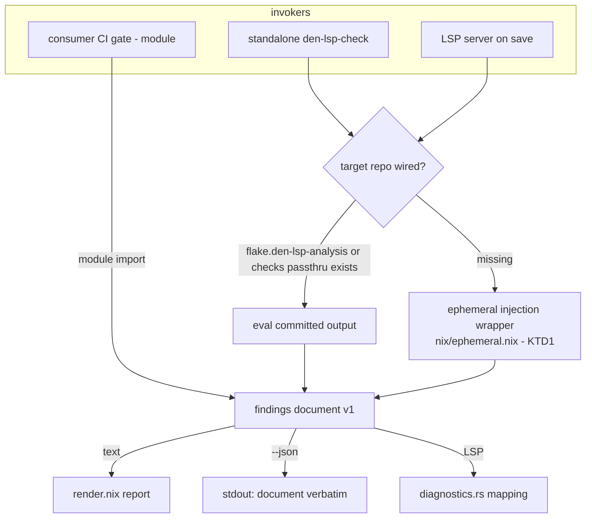
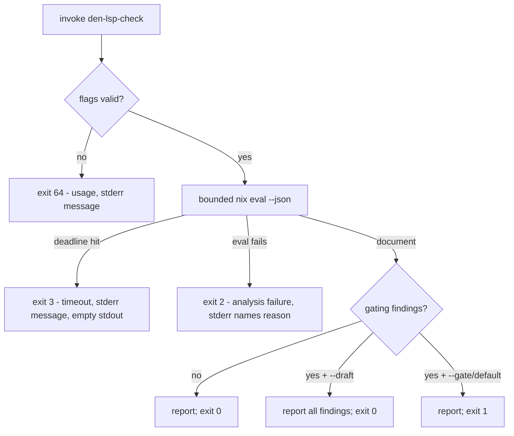

# Field Readiness — Zero-Touch Analysis and Agent CLI Contract - Plan

## Goal Capsule

- **Objective:** Make den-lsp runnable against any stock Den consumer repo (den ≥ v0.18.0) with zero repo edits — via the CLI and the LSP server — and give coding agents a stable machine-readable CLI contract. Roadmap Focus 2 (`docs/ideation/2026-08-03-den-lsp-roadmap-ideation.html`, §f2).
- **Authority:** Requirements (R-IDs) govern product behavior; KTDs govern mechanism within their cited Rs; units override neither.
- **Stop conditions:** Stop and surface if U1 finds no injection mechanism that reaches a stock flake-parts consumer's `config.den` (KTD1 candidates exhausted), or if preserving wired-consumer behavior (R3) conflicts with the fallback design. If the winning variant reaches only a subset of consumer shapes (e.g. module-tree but not inline-`flake.nix` aspects), pause for user approval to re-scope R1 and the README's reachable-set language, or continue down the variant list — never ship the broad claim over a narrow mechanism.
- **Execution profile:** Stacked single-concern PRs per KTD7. Verify each unit with the repo's existing gates before stacking the next.
- **Tail ownership:** Executor owns tests, docs landing, and cleanup of abandoned mechanism experiments from U1.

---

## Product Contract

### Summary

Ship three field-readiness capabilities: (1) zero-touch ephemeral analysis injection, so den-lsp analyzes a stock Den flake with no den-lsp flake input and no committed module; (2) an agent-consumable CLI contract — `--json` findings output, documented exit-code taxonomy, `--draft`/`--gate` strictness flags; (3) an operational field-failure intake pathway plus the CLI half of the reliability floor (bounded evaluation, structured timeout outcome). The flake-parts module remains solely the committed CI gate. The README leads with the zero-touch paths.

### Problem Frame

den-lsp's only entry today is a two-step committed wiring: add a flake input, import a flake-parts module. That inverts the LSP mental model (install binary → point editor → diagnostics) and blocks try-before-adopt, arbitrary-repo analysis, and sniff tests. Headless output is a text report agents must scrape, with a single-bit exit status. A prior sniff test against a real Den repo surfaced bugs clean fixtures never triggered — field exposure produces evidence, so entry friction is a defect generator we're leaving idle.

### Key Decisions

- KD1. **Zero-touch is the primary consumption path; the flake-parts module survives only as the committed CI gate.** (session-settled: user-approved — chosen over shipping a plainer-flake variant of the module: the friction is repo-edit-as-precondition, not flake shape.) Governs R1, R2, R3, R13.
- KD2. **Zero-knob stance: behavior is controlled by ephemeral invocation flags; no repo config, no per-finding suppression.** Carried from the ideation record (§f2b). Governs R8, R9.

### Requirements

**Zero-touch analysis**

- R1. The standalone CLI, run from den-lsp's own flake, analyzes a stock Den consumer flake (den ≥ v0.18.0, following den's flake-parts template shape) that has no den-lsp input and no committed den-lsp module. U1 documents the exact reachable consumer set; R13's README language must match it.
- R2. The LSP server produces diagnostics for such an unwired repo, with wired-repo target precedence unchanged.
- R3. Wired consumers keep current behavior: gate check, module-generated apps, and analysis outputs are unchanged.
- R4. A target the wrapper cannot analyze (no Den, den < v0.18.0, unreachable den config) produces a clear diagnostic naming the reason — never a raw Nix trace as the only signal.

**Agent CLI contract**

- R5. `--json` writes exactly the version-1 findings document (`nix/engine/document.nix`) to stdout; no other bytes reach stdout.
- R6. Human-facing text (progress, errors, the report in `--json` mode) goes to stderr; text mode keeps the report on stdout as today.
- R7. Exit codes form a documented taxonomy distinguishing: success (clean or advisory-only), gating findings, analysis failure, timeout, and usage error (see KTD4).
- R8. `--draft` reports all findings and exits success despite gating findings; `--gate` (the default) fails on gating findings. The flags are mutually exclusive.
- R9. Strictness and output mode are invocation flags only.

**Reliability floor**

- R10. The CLI bounds evaluation time; timeout produces the documented exit code and a stderr explanation, not a hang.
- R11. Existing server reliability guarantees hold after the fallback change: 60s eval deadline, superseded-eval cancellation, stale-publication guard, last-known-good retention.

**Intake and docs**

- R12. The field-failure intake pathway is documented and operational: a field breakage (crash, wrong finding, hang/timeout) has a written procedure ending in a minimized corpus fixture per the CONCEPTS.md Field-Failure Intake taxonomy.
- R13. The README leads with zero-touch usage (editor LSP, then CLI); flake-parts wiring is documented as the committed CI-gate option.

### Success Criteria

- Try-before-adopt is one command against an unmodified repo: `nix run github:nehpz/den-lsp#den-lsp-check -- <path>`.
- An agent can branch on exit code alone and parse findings from `--json` without scraping text.
- Scope honesty: this plan claims detection and gating consumability only. Repair success and time-to-valid-repair move with Focus 3's structured fixes; shipping R5–R8 alone is not claimed to lift those metrics.

### Acceptance Examples

- AE1. **Unwired repo, gating defect.** Given a stock Den consumer with an identical multi-attribute block duplicated across aspects (the `duplication` gating rule, matching the existing gating fixture), when the CLI runs with `--json`, then stdout parses as a v1 document containing the gating finding and the exit code is the gating code.
- AE2. **Draft mode.** Given the same repo, when the CLI runs with `--draft`, then all findings are still reported and the exit code is success.
- AE3. **Broken eval.** Given a consumer whose flake fails evaluation, when the CLI runs with `--json`, then stdout carries no partial JSON, stderr names the failure, and the exit code is the analysis-failure code.
- AE4. **Unwired repo in the editor.** Given the LSP server pointed at an unwired stock Den repo, when a buffer is saved, then findings appear as diagnostics without any repo edit.
- AE5. **Wired repo unchanged.** Given a consumer importing `flakeModules.default`, when `nix flake check` and `nix run .#den-lsp-check` run, then the exit codes and the finding set (rule/severity/aspectPath) are what they are today; report text is compared normalized, not byte-for-byte.

### Scope Boundaries

**In scope:** flake-parts-shaped Den consumers (the den template pattern); the standalone CLI; the server fallback; intake docs; README restructure.

**Deferred to Follow-Up Work**

- Zero-touch for plain `evalModules` (noflake) consumers — the injection shim targets the flake-parts entry point; noflake consumers keep the committed `flakeModules.noflake` path for now.
- Machine-readable structured fix payloads and findings v2 (roadmap Focus 3) — R5's JSON channel is their future carrier, not their delivery.
- Richer CLI metadata (streaming, telemetry, timing) — add when an agent consumer demonstrates need.

**Outside this product's identity**

- Per-finding or per-repo suppression config (a wrong gating finding is a rule bug — fix or demote the rule).
- Any MCP server surface (dropped in ideation; absorbed as plain CLI affordances).

### Sources

- `docs/ideation/2026-08-03-den-lsp-roadmap-ideation.html` §f2 — Focus 2 definition (2a/2b/2c).
- `docs/solutions/conventions/plan-time-pr-topology-and-real-user-gating.md` — stacked single-concern PRs; oversized diffs self-feed review churn.
- `docs/solutions/test-failures/golden-mismatch-unpinned-free-variables.md` — pin agent-chosen free variables in golden scenarios.
- `CONCEPTS.md` — Field-Failure Intake taxonomy (hangs/timeouts → hermetic fixtures; repair defects → goldenable scenarios), gating/advisory semantics.
- den v0.18.0 source, `nix/lib/namespace.nix` — den exports only the `denful` namespace as a flake output, never full `config.den`; reading a stock consumer's outputs cannot reach the aspect graph. This forces re-entering the consumer's evaluation (KTD1).
- `fixtures/scenarios/flake.nix` — proves `flake-parts.lib.evalFlakeModule` can compose den + den-lsp modules around an external workspace (KTD1 candidate c).
- The 2026-08-07 evidence-kernel GO readout (session-only artifact; not retained in-tree and not independently retrievable from the repository). Scope provenance: zero-touch injection and the runtime CLI were parked by the PR #9 real-user audit (PR-topology convention above); un-parked by the user's Focus 2 directive in this planning session, after that readout.

---

## Planning Contract

### Key Technical Decisions

- KTD1. **Injection mechanism: re-enter the consumer's flake-parts evaluation from outside; U1 settles which variant.** Candidates, in order of attempt: (a) `nix eval --override-input flake-parts <shim>` where the shim flake wraps real flake-parts and its `lib.mkFlake` appends the den-lsp module — requires a preflight that discovers the consumer's flake-parts node from the lock, since the input may be renamed (a renamed input is its own R4 error, distinct from "no flake-parts input"); (b) `nix eval --expr` importing the consumer's raw `flake.nix`, calling its `outputs` with locked inputs where flake-parts is substituted by the same shim; (c) `evalFlakeModule` recomposition of den + den-lsp + the consumer's on-disk module tree (the `fixtures/scenarios/flake.nix` pattern — proven, but blind to aspects defined inline in `flake.nix`). Constraint: den exposes no `config.den` output (see Sources), so output-reading approaches are ruled out. U1 records the reachable consumer set of the winning variant.
- KTD2. **CLI substrate: a shell app exposed on den-lsp's own flake, reusing `nix/check-core.nix` and `nix/engine/render.nix`; no Rust CLI.** The findings document is already JSON via `nix eval --json`; a Rust binary would duplicate the server's eval plumbing for no capability gain.
- KTD3. **`--json` emits document v1 verbatim; failure modes emit no stdout JSON.** The schema's `version` field is the evolution mechanism — no wrapper envelope. On analysis failure or timeout, stdout stays empty; the exit code is the machine signal and stderr the explanation. Agents branch on exit code before parsing. Deliberate deviation from ideation §f2c's "timeout surfaced as a finding": the v1 document stays untouched, and the LSP surface already reports timeout as a diagnostic.
- KTD4. **Exit taxonomy:** 0 = analysis completed, nothing blocking (clean, advisory-only, or any findings under `--draft`); 1 = gating findings under `--gate`; 2 = analysis failure (eval error, not a Den flake, unsupported den); 3 = timeout; 64 = usage error. The CLI wraps `nix` and translates its exits — nix's own codes never leak through. Default deadline: 60s, matching the server's `EVAL_TIMEOUT`, so CLI and LSP agree on the same repo.
- KTD5. **Server target order: `den-lsp-analysis` → `checks.<system>.den-lsp.passthru.analysis` → ephemeral injection.** Wired repos resolve before injection is attempted, preserving committed behavior (R3).
- KTD6. **One renderer and one exit-semantics source, shared via `check-core`, between the module-generated app and the standalone CLI.** Prevents contract drift between the CI gate and the field CLI.
- KTD7. **Stacked single-concern PRs — one PR per implementation unit** per the PR-topology convention (see Sources).
- KTD8. **The ephemeral wrapper is embedded in the server binary at build time**, not resolved from a den-lsp flake at runtime — self-contained editor installs, no version skew between server and wrapper. The CLI reads the same `nix/ephemeral.nix` from its own flake checkout; both surfaces ship the identical revision.

### High-Level Technical Design

Analysis-target resolution across the three surfaces:

CLI invocation outcome flow (KTD3, KTD4):

Directional guidance: the shapes above fix outcome routing, not script structure.

### Assumptions

- Target consumers follow den's flake-parts template shape (a `flake-parts` input feeding `mkFlake`). Consumers with exotic flake wiring may be unreachable by variants (a)/(b); U1 documents the reachable set.
- `nix` on the invoking machine can evaluate the target (flakes enabled, inputs fetchable). The CLI does not manage nix installation.

### Sequencing

U1 gates U2 and U4. U3 extends U2. U5 verifies U2+U3. U6 and U7 are independent docs work; U7 lands last so it documents shipped behavior. PR stacking: one PR per unit — PR1 = U1, PR2 = U2, PR3 = U3, PR4 = U4, PR5 = U5, PR6 = U6, PR7 = U7.

---

## Implementation Units

### U1. Ephemeral injection wrapper

- **Goal:** Produce the v1 analysis document from an unwired stock Den consumer via external invocation, with clear failures for unanalyzable targets.
- **Requirements:** R1 (foundation), R4. Implements KTD1.
- **Dependencies:** none.
- **Files:** `nix/ephemeral.nix` (new — wrapper expression and/or shim flake), `flake.nix` (expose the wrapper), `fixtures/unwired/` (new fixture family mirroring the wired matrix: base, gating, advisory-only, broken — plus an inline-imports variant with aspects declared inline in `flake.nix` as the reachability probe), `fixtures/run-checks.bash` (unwired rows).
- **Approach:**
  1. Build `fixtures/unwired/` first — it is the acceptance instrument.
  2. Attempt KTD1 variants in order (a), (b), (c) until the fixture yields a document; record why rejected variants fail.
  3. Add an explicit den version-floor gate in `nix/ephemeral.nix` — no version check exists anywhere under `nix/` today, and the entity-mode throw in `nix/den-analysis.nix` is never hit in fleet mode — failing with a message that names the v0.18.0 floor, asserted by a fixture row.
  4. Route unanalyzable targets to distinct, message-bearing errors: no `flake-parts` input, flake-parts present under a nonstandard input name, no den, den < v0.18.0, and den config unreachable by the winning variant.
- **Execution note:** Verification-first — the mechanism decision is settled by making the unwired fixture produce the same findings the wired fixture produces. Delete losing-variant code before the PR (KTD7).
- **Patterns to follow:** `fixtures/scenarios/flake.nix` (`evalFlakeModule` composition, explicit `systems`), `nix/check.nix` (`mkDefault` injection).
- **Test scenarios:**
  - Covers AE1 (mechanism half). Unwired fixture evaluates to a document whose findings equal the wired `fixtures/consumer` document's findings.
  - Unwired fixture with a seeded gating defect yields that gating finding.
  - A non-Den flake target fails with an error naming the missing den prerequisite, not an attribute-missing trace.
  - A den < v0.18.0 target fails with an error naming the version floor.
  - The inline-imports unwired variant yields the same findings as its wired equivalent — or, if the winning variant cannot reach it, fails with a distinct R4 error and triggers the Goal Capsule's re-scope pivot.
  - A target whose flake-parts input is renamed fails with the nonstandard-input-name error, not the missing-flake-parts error.
- **Verification:** `fixtures/run-checks.bash` passes with the new unwired rows; `nix flake check` stays green.

### U2. Standalone CLI on den-lsp's flake

- **Goal:** `nix run <den-lsp>#den-lsp-check -- <path>` renders the fix-shaped text report for any target repo — wired or unwired — with today's exit semantics.
- **Requirements:** R1, R3. Implements KTD2, KTD6.
- **Dependencies:** U1.
- **Files:** `nix/check-core.nix` (factor renderer/exit logic for reuse), new CLI entry (e.g. under `nix/`), `flake.nix` or `nix/dev.nix` (expose `apps.den-lsp-check` / package), `fixtures/run-checks.bash` (CLI rows).
- **Approach:** Wired targets eval the committed output; unwired targets route through U1's wrapper (KTD5 order, minus the LSP-specific parts). The module-generated per-consumer app keeps working and shares the renderer (KTD6).
- **Test scenarios:**
  - Clean and advisory-only targets exit 0; report text matches the module app's output for the same wired fixture (drift guard for KTD6).
  - Gating target exits 1 and names the involved aspects.
  - Covers AE5. Wired fixture behavior unchanged under the module app.
- **Verification:** CLI smoke run against `fixtures/unwired` and `fixtures/consumer` from a clean checkout.

### U3. Agent contract: `--json`, strictness flags, exit taxonomy, deadline

- **Goal:** The CLI is machine-consumable: verbatim v1 JSON, documented exit codes, `--draft`/`--gate`, bounded evaluation.
- **Requirements:** R5, R6, R7, R8, R9, R10. Implements KTD3, KTD4.
- **Dependencies:** U2.
- **Files:** the U2 CLI entry, `fixtures/run-checks.bash` (contract rows).
- **Approach:**
  1. `--json`: pass the `nix eval --json` document through untouched; move all human text to stderr.
  2. `--draft`/`--gate`: flag parsing with mutual-exclusion check; strictness only changes the exit mapping, never the findings.
  3. Deadline: wrap the eval in a bounded timeout (overridable via flag if trivial; otherwise fixed default) mapping to exit 3.
  4. Document the taxonomy in the CLI's `--help` and README (landed in U7).
- **Test scenarios:**
  - Covers AE1. `--json` on the gating fixture: stdout parses as JSON with `version == 1` and the expected finding; nothing else on stdout.
  - Covers AE2. `--draft` on the gating fixture exits 0 and the finding is still present in output.
  - `--gate` (and no flag) on the gating fixture exits 1.
  - Covers AE3. Broken-eval fixture with `--json`: empty stdout, stderr names the failure, exit 2.
  - Timeout path exits 3 with empty stdout in `--json` mode (exercised with a near-zero deadline against a real eval).
  - `--draft --gate` together, and an unknown flag, each exit 64 with a usage message.
- **Verification:** New `fixtures/run-checks.bash` contract rows pass.

### U4. LSP server zero-touch fallback

- **Goal:** The server produces diagnostics on an unwired stock Den repo by falling back to ephemeral injection.
- **Requirements:** R2, R11. Implements KTD5.
- **Dependencies:** U1.
- **Files:** `server/src/eval.rs` (third target + inline tests), possibly `server/src/main.rs`.
- **Approach:** Extend the existing target-fallback chain: after both committed targets return missing-attribute errors, invoke U1's wrapper — the same entrypoint the CLI uses — supplying the consumer path as the target (injection is not a third consumer-flake attribute probe; the unwired flake has no den-lsp attribute to eval). The wrapper expression is embedded in the server binary at build time (KTD8). Injection failures map to the existing eval-error diagnostic path; last-known-good retention untouched.
- **Test scenarios:**
  - Covers AE4. Unwired-repo eval resolves via the injection target and yields findings.
  - Wired repo (either committed target present) never attempts injection.
  - Injection failure yields one eval-error diagnostic and retains last-known-good state.
  - The injection expression is invoked only after both committed targets return missing-attribute errors (asserted in `server/src/eval.rs` inline tests).
  - Existing debounce, timeout, cancellation, and stale-publication tests still pass unmodified (R11).
- **Verification:** `nix develop -c cargo test` in `server/`; manual editor smoke against `fixtures/unwired`.

### U5. E2E matrix extension

- **Goal:** The fixture matrix proves the zero-touch and contract behavior end to end, hermetically.
- **Requirements:** verification for R1, R5, R6, R7, R8, R9, R10.
- **Dependencies:** U2, U3.
- **Files:** `fixtures/run-checks.bash`, `fixtures/unwired/`, `tools/evidence-runner/` (route one scenario's analysis leg through the zero-touch CLI).
- **Approach:** Extend the existing base/gating-dup/advisory-only/broken matrix with unwired and contract rows (several already introduced by U1–U3; this unit closes coverage gaps and keeps rows single-assertion). The unwired fixture family from U1 supplies the unwired column. JSON assertions pin exact expected fields per the golden-mismatch learning — no unpinned free variables.
- **Test scenarios:**
  - Full matrix: {wired, unwired} × {clean, advisory, gating, broken} × {text, `--json`} with expected exit codes.
  - JSON output byte-stability check across two runs of the same fixture (determinism guard).
  - One existing eval-corpus scenario workspace analyzed via the zero-touch `den-lsp-check --json` path produces the findings the hermetic tier expects (the evidence-runner leg).
- **Verification:** `bash fixtures/run-checks.bash` green from a clean checkout.

### U6. Field-failure intake operationalization

- **Goal:** A field breakage has a written, followed pathway into the eval corpus.
- **Requirements:** R12.
- **Dependencies:** none.
- **Files:** `docs/field-failure-intake.md` (new, short), `README.md` (link — landed with U7).
- **Approach:** Document the pathway: capture the failing invocation → minimize → classify per CONCEPTS.md (crash/hang/timeout → hermetic fixture; wrong finding / repair defect → goldenable scenario with pinned free variables) → land the fixture with its check. Cite CONCEPTS.md definitions; do not restate them.
- **Test expectation:** none — convention/docs unit; the contract is enforced by review convention, not code.
- **Verification:** Doc names each CONCEPTS.md failure class and its destination tier.

### U7. README restructure — LSP-first

- **Goal:** README reads like an LSP: install, point editor, done; CLI quickstart next; flake-parts wiring demoted to a CI-gate section.
- **Requirements:** R13.
- **Dependencies:** U2, U3, U4.
- **Files:** `README.md`.
- **Approach:** Lead with editor setup (server install + zero-touch behavior), then agent CLI usage with the exit taxonomy and `--json`/`--draft`/`--gate`, then "CI gate" (current consumer-wiring content), then development. Every command shown must be one that ships in this plan.
- **Test expectation:** none — docs unit.
- **Verification:** Run each README command verbatim against the fixtures; all behave as documented.

---

## Verification Contract

| Gate | Command | Proves |
|---|---|---|
| Engine + scenarios | `nix flake check` | Engine rules, scenario detection tier, no regressions (R3) |
| E2E matrix | `bash fixtures/run-checks.bash` | Zero-touch rows, CLI contract rows, exit taxonomy (R1, R5–R10) |
| Server tests | `nix develop -c cargo test` (in `server/`) | Fallback order, reliability guarantees (R2, R11) |
| CLI smoke | `nix run .#den-lsp-check -- fixtures/unwired --json` piped to a JSON parser | R1 + R5 live, from a clean checkout |

## Definition of Done

- Every R is satisfied or explicitly re-scoped with user approval; AE1–AE5 demonstrably hold.
- All four verification gates green from a clean checkout.
- U1's losing mechanism experiments are deleted; no scaffold or dead code remains in the diff.
- README commands are executable as written; the exit taxonomy is documented in `--help` and README and the two do not disagree.
- At least one eval-corpus scenario runs end-to-end through the zero-touch `den-lsp-check --json` path in the evidence runner.
- Each PR in the stack is single-concern per KTD7.
